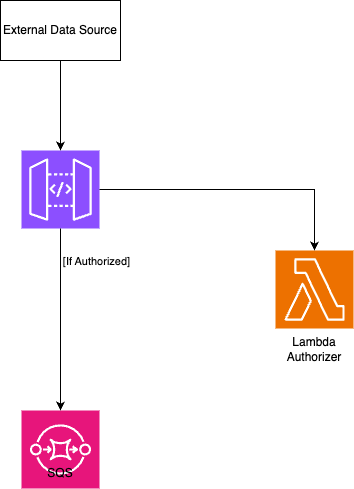

# STCP Realtime Data Ingestor

AWS Infrastructure to receive bus events notifications using API Gateway with a Lambda Authorizer and an SQS.

[//]: # (## TODO: Improve diagram)

The project's output is a [Docker](https://docs.docker.com/) image, which wraps around a JVM executable, and is stored in [AWS Elastic Container Registry](https://aws.amazon.com/ecr/) to be used in the [AWS ECS Task Definition](https://docs.aws.amazon.com/AmazonECS/latest/developerguide/task_definitions.html).

This repository contemplates the following modules:

- **authorizer**: main project;
- **terraform**: a set of a set of [terraform](https://www.terraform.io) scripts which allow provisioning of the [AWS](https://aws.amazon.com/) infrastructure.

Refer to each module **README.md** file, for more information.

## Packaging

`mvn package`
