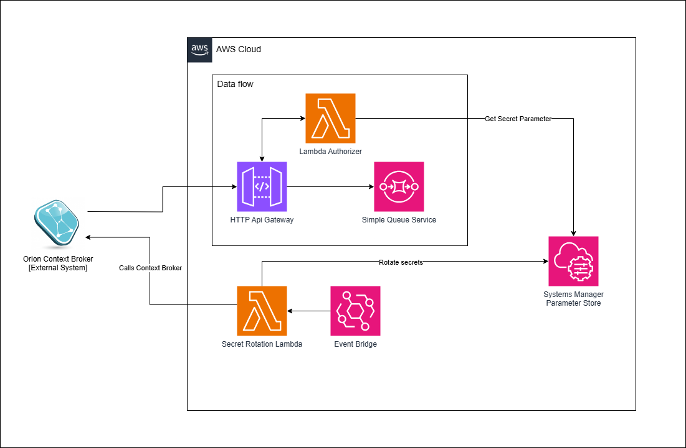

# STCP Realtime Data Ingestor

The project's creates the infrastructure needed for the data ingestion of the buses real time location. \
This is done using API Gateway and an SQS.

This repository contemplates the following modules:

- **authorizer**: Custom Lambda Authorizer for the API Gateway;
- **terraform**: a set of [terraform](https://www.terraform.io) scripts which allow provisioning of the [AWS](https://aws.amazon.com/) infrastructure.

Refer to each module **README.md** file, for more information.

## Packaging

`mvn package`
